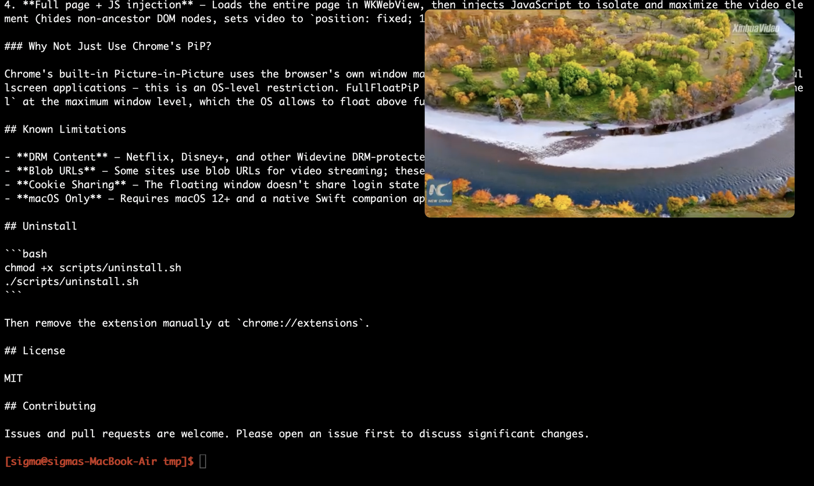

# FullFloatPiP

**English | [中文](README-zh.md)**

**Picture-in-Picture that floats over EVERYTHING — including fullscreen apps.**

The only Chrome extension that creates truly always-on-top floating video windows above **all** applications — fullscreen Terminal, fullscreen IDE, fullscreen anything. Built for developers who vibe code with videos, tutorials, or streams playing alongside their work.

> No other PiP tool, Chrome extension, or browser feature can float a video over a macOS fullscreen app. FullFloatPiP can.

<p align="center">
  
  <br>
  <sub><i>The FullFloatPiP window floating above a fullscreen Terminal — browser is not even visible, and the video keeps playing.</i></sub>
</p>

## Why FullFloatPiP?

Every existing PiP solution fails when you go fullscreen:

| Feature | Chrome Built-in PiP | PiPifier (Safari) | Other Extensions | **FullFloatPiP** |
|---|---|---|---|---|
| Float over normal windows | Yes | Yes | Yes | **Yes** |
| Float over fullscreen apps | No | No | No | **Yes** |
| Visible across all Spaces/Desktops | No | Partial | No | **Yes** |
| YouTube-style controls | No | No | Varies | **Yes** |
| Works with any video site | Limited | Safari only | Varies | **Yes** |

**The core problem:** Chrome's browser sandbox prevents creating windows above fullscreen applications. FullFloatPiP solves this with a hybrid architecture — a Chrome extension for video detection paired with a native macOS app (Swift/AppKit) that creates a system-level floating window at the highest window level.

## Perfect for Vibe Coding

Vibe coding means staying in flow — fullscreen Terminal or IDE, no distractions, just code. But sometimes you want a tutorial, a conference talk, or lo-fi beats playing in the corner.

With FullFloatPiP:
1. Open YouTube (or Bilibili, Twitch, etc.) in Chrome
2. Click the FullFloatPiP icon, select the video, hit **Float**
3. Switch to your fullscreen Terminal / VS Code / Cursor / Xcode
4. The video stays floating in the corner — always visible, always on top

For a video already playing in the active Chrome tab, press **⌃⇧Y** (Control–Shift–Y on macOS) to float it directly. The popup shows the shortcut Chrome has actually assigned. You can change it at `chrome://extensions/shortcuts`.

No window switching. No split screen. No leaving fullscreen. Just code and video, together.

## Features

- **Truly Always-on-Top** — Floats above ALL apps including macOS fullscreen applications
- **Cross-Space Visibility** — Video window visible across all macOS Desktops / Spaces
- **PiP-Style UI** — Clean, borderless video window; controls appear on hover
- **YouTube-Style Control Bar** — Play/pause, skip 10s, volume slider, progress bar with seek, time display
- **Auto Video Detection** — Badge shows video count; auto-detects SPA navigation (YouTube, Bilibili)
- **Quick Float Shortcut** — Float the active tab's playing video without opening the popup
- **Last-used Popup Tab** — Opens where you left off; movie data loads only when you visit the catalog
- **Aspect Ratio Lock** — Window maintains video aspect ratio during resize
- **Position Memory** — Remembers window position and size between sessions
- **Drag & Resize** — Drag from title bar, resize from any edge/corner
- **Opacity Toggle** — Semi-transparent mode for less visual obstruction
- **Multi-Site Support** — YouTube, Bilibili, Twitch, Youku, iQiyi, Tencent Video, Douyin, Netflix*, and any site with HTML5 video

## Supported Video Sites

| Site | Strategy | Notes |
|---|---|---|
| YouTube | Embed via local HTTP server | Cookie forwarding, Referer workaround for Error 153 |
| Bilibili | Player embed | High quality, no danmaku |
| Twitch | Player embed | Live streams supported |
| Youku | Player embed | — |
| iQiyi | Full page + JS injection | — |
| Tencent Video | Full page + JS injection | — |
| Douyin | Full page + JS injection | — |
| Netflix | — | DRM protected, won't play* |
| Any other site | Auto-detect `<video>` elements | Falls back to full page load + JS isolation |

## Installation

### Requirements

- macOS 12 (Monterey) or later
- Google Chrome
- Xcode Command Line Tools

### Steps

```bash
# 1. Install Xcode Command Line Tools (if not already installed)
xcode-select --install

# 2. Clone the repository
git clone https://github.com/Sigmame/full-float-pip.git
cd full-float-pip

# 3. Run the install script
chmod +x scripts/install.sh
./scripts/install.sh
```

The install script will:
1. Compile the Swift native app
2. Install the executable to `~/Library/Application Support/FloatVideo/`
3. Configure Chrome Native Messaging Host
4. Prompt you to load the Chrome extension

Then load the extension in Chrome:
1. Open `chrome://extensions`
2. Enable **Developer mode**
3. Click **Load unpacked** and select the `extension/` folder
4. Copy the Extension ID and enter it when prompted by the install script

## Usage

1. Navigate to any video site (YouTube, Bilibili, etc.)
2. Click the **FullFloatPiP** icon in the Chrome toolbar — the badge shows detected video count
3. Select a video from the popup and click **Float**
4. The video pops out into a floating window with a loading spinner
5. Switch to any app, even fullscreen — the video stays on top

### Controls (appear on hover)

- **Title bar** — Drag to move; close (red), opacity toggle (yellow), pin indicator (green)
- **Progress bar** — Click anywhere to seek; red bar shows playback position
- **Play/Pause** — Toggle playback
- **Skip 10s** — Jump forward 10 seconds
- **Volume** — Mute toggle + slider
- **Time display** — Current position / total duration
- **ESC** — Close the floating window
- **Resize** — Drag any edge or corner (aspect ratio locked)

## How It Works

```
Chrome Extension ──[Native Messaging (stdio)]──> Swift Native App
 (video detection)                                (floating window)
```

### Architecture

FullFloatPiP uses a dual-component architecture to bypass Chrome's sandbox limitations:

**Chrome Extension (Manifest V3)**
- `content.js` — Injected into web pages. Detects `<video>` elements, extracts sources, titles, dimensions. Monitors SPA navigations via MutationObserver.
- `background.js` — Service Worker. Bridges between content script/popup and the native app via Chrome's Native Messaging API. Manages process lifecycle.
- `popup.js` — Extension popup UI. Shows detected videos with a "Float" button.

**Native macOS App (Swift)**
- `AppDelegate.swift` — Receives messages from Chrome, routes open/close/ping actions.
- `FloatWindow.swift` — Core implementation. Creates an `NSPanel` at window level `maximumWindow + 1` with collection behavior `canJoinAllSpaces` + `fullScreenAuxiliary`. This is what makes it float above fullscreen apps and appear on all Spaces.
- `LocalHTTPServer.swift` — Ephemeral HTTP server on a random port. Serves YouTube embed pages with the correct `Referer` header to avoid Error 153. Includes YouTube IFrame API bridge for playback control.
- `NativeMessageHandler.swift` — Chrome Native Messaging protocol (4-byte little-endian length prefix + UTF-8 JSON).

### Video Loading Strategies

The native app uses a priority-based loading strategy:

1. **Direct video source** — If the `<video>` element has a non-blob `src`, load it directly in a `<video>` tag
2. **YouTube via local HTTP server** — Embeds YouTube iframe with proper Referer, cookie injection, and IFrame API for control
3. **Site-specific embed** — Uses clean player embeds (Bilibili Player, Twitch Player, Youku embed)
4. **Full page + JS injection** — Loads the entire page in WKWebView, then injects JavaScript to isolate and maximize the video element (hides non-ancestor DOM nodes, sets video to `position: fixed; 100vw x 100vh`)

### Why Not Just Use Chrome's PiP?

Chrome's built-in Picture-in-Picture uses the browser's own window management. On macOS, browser windows cannot be placed above fullscreen applications — this is an OS-level restriction. FullFloatPiP works around this by using a **native macOS app** with `NSPanel` at the maximum window level, which the OS allows to float above fullscreen apps.

## Known Limitations

- **DRM Content** — Netflix, Disney+, and other Widevine DRM-protected platforms cannot play in the floating window
- **Blob URLs** — Some sites use blob URLs for video streaming; these fall back to full-page load with JS injection
- **Cookie Sharing** — The floating window doesn't share login state with Chrome; some sites may require re-login
- **macOS Only** — Requires macOS 12+ and a native Swift companion app; not available on Windows/Linux

The local `scripts/vibe-sync.sh` control tool reads a private token from `~/.floatvideo_token` while the player is running. Reinstall the native companion to use this version of the tool; direct HTTP calls to `/api/` now require the `X-VibeFloat-Token` header.

## Uninstall

```bash
chmod +x scripts/uninstall.sh
./scripts/uninstall.sh
```

Then remove the extension manually at `chrome://extensions`.

## License

MIT

## Contributing

Issues and pull requests are welcome. Please open an issue first to discuss significant changes.
